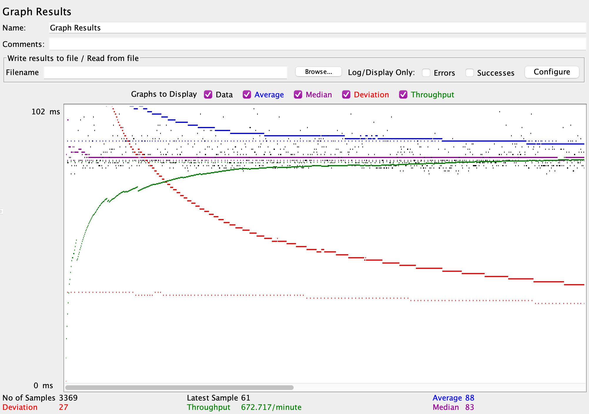
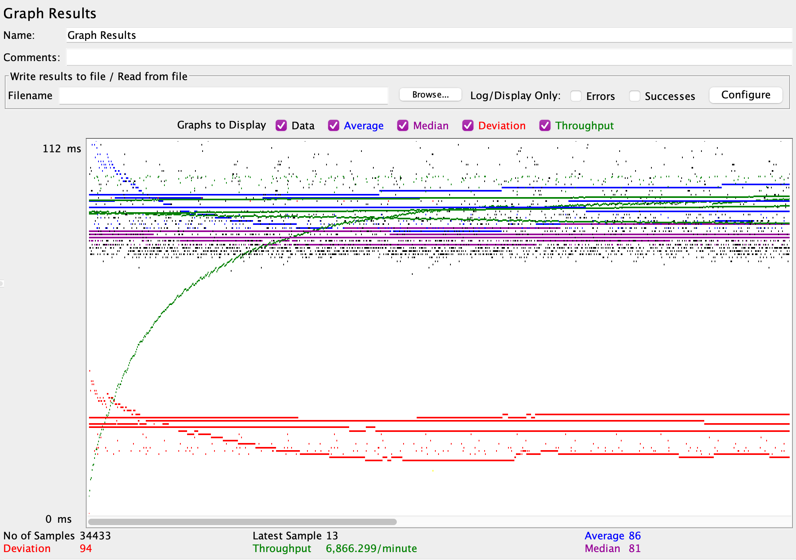
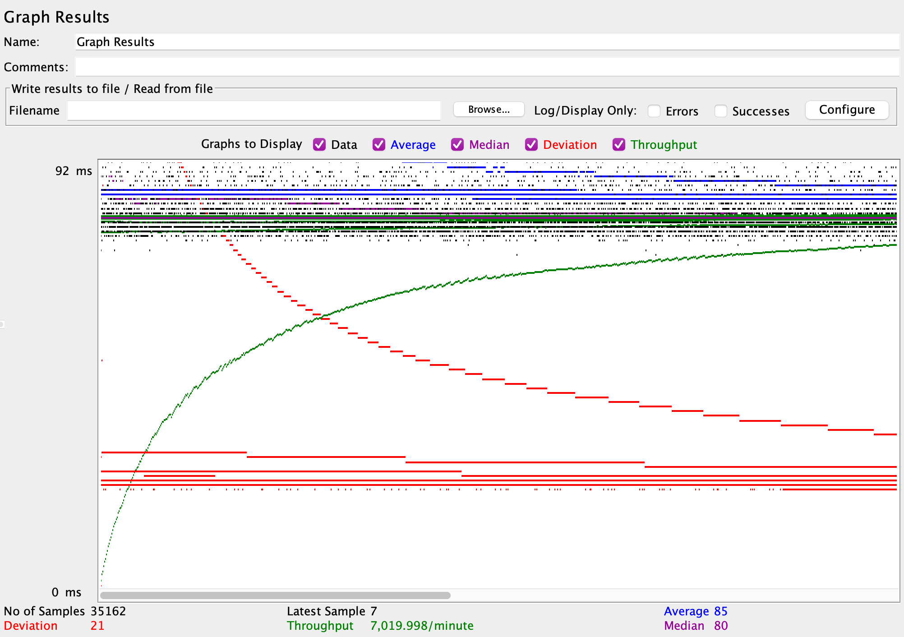
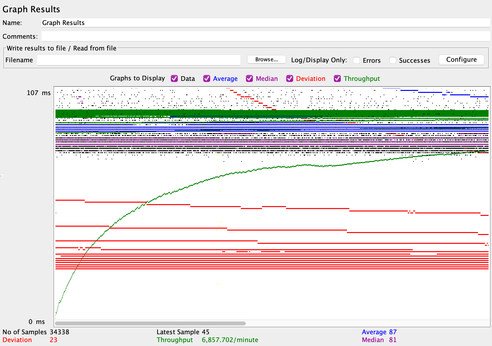
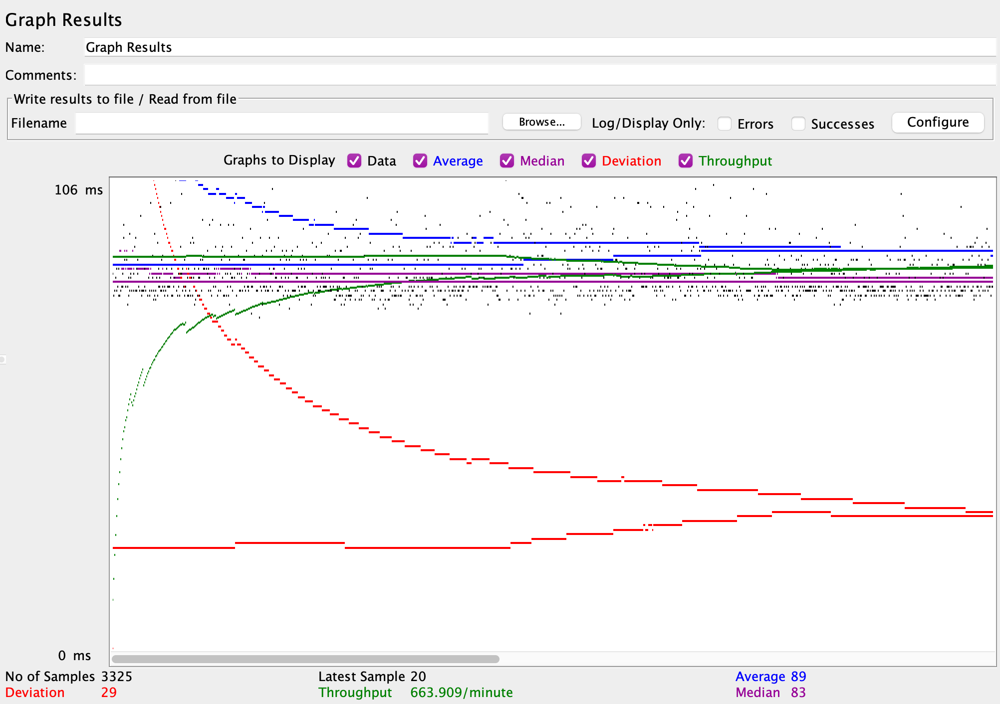
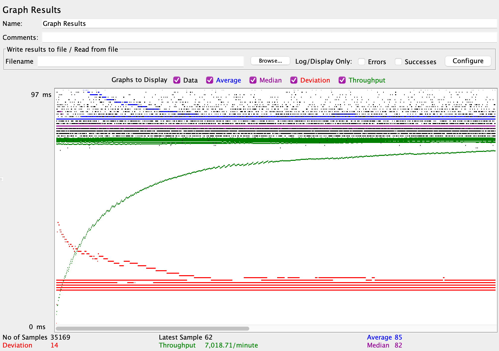
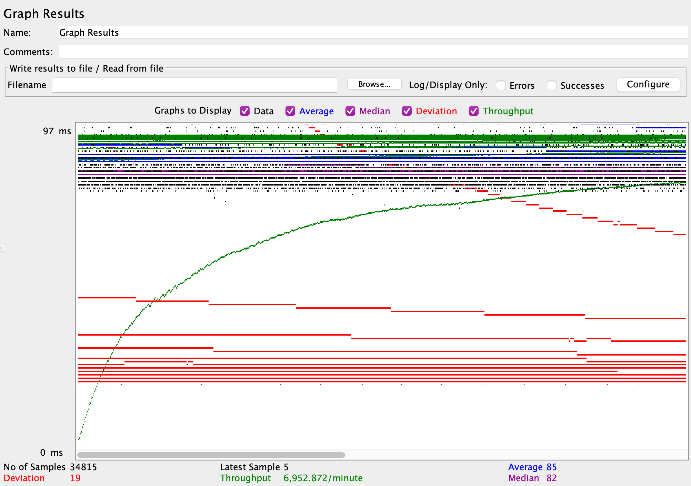

# 2023-fall-cs122b-i-3cs

- # General
    - #### Team: i-<3-cs

    - #### Names: Rithvij Pochampally and Kirby Ammari
    
    - #### Project 5 Video Demo Link: [Link to Demo Video (Project 5)](https://drive.google.com/file/d/1DpQfunm_UVk-sn6byLiKWUODLvCgbTU0/view?usp=sharing)

    - #### Instruction of deployment:
    - - once the web apps are deployed correctly in all instances, the jMeter tests were run to their respective instances and settings.
    - - The log files created were copied using an ssh software and then log_processing.py was executed with the correct file path(s).

    - #### Collaborations and Work Distribution: Split setting up instances/jMeter test, ran the code together (pair programming).

- # Connection Pooling
    - #### Include the filename/path of all code/configuration files in GitHub of using JDBC Connection Pooling.
    - - context.xml 
    - - SearchResultsServlet.java utilizes this the most with our testing
    
    - #### Explain how Connection Pooling is utilized in the Fabflix code.
    - - Tomcat creates many connections and rotates through those connections. 
    - - In our code, when so many searches are made, tomcat can rotate through those rather than open and close a connection each time, causing the overall speed to increase.
    
    - #### Explain how Connection Pooling works with two backend SQL.
    - - The load balancer divides the requests and send it to the two tomcat instances, to which connection pooling is utilized.
    - - Same as mentioned above, the requests can rotate through the existing connections so new connections don't need to be opened every request, saving a lot of time.
    - - The connections in the tomcat servers can read from any of the backed SQL instances, optimizing reads to be very fast.
    

- # Master/Slave
    - #### Include the filename/path of all code/configuration files in GitHub of routing queries to Master/Slave SQL.
    - - SearchResultsServlet.java is what does the searching and queries the databases
    - - In context.xml a new resource was created only for accessing the master sql db specifically
    - - AddMovieServlet.java and AddStarServlet.java used a different resource in context.xml
    - - 000-default.conf in the load balancer AWS instance has the directions for directing SQL queries to the other instances.

    - #### How read/write requests were routed to Master/Slave SQL?
    - - The load balancer gets requests, and they are routed to the other two tomcat servers in the other two AWS instances to be processed.
    - - The tomcat servers can read from either SQL instance, and the write requests are only sent to the master sql database.
    - - Any servlet that has write requests use a new resource defined in the context.xml that specifically access the master sql db only, otherwise it accesses the localhost server of the AWS instance, which can be the master or slave
    

- # JMeter TS/TJ Time Logs
    - #### Instructions of how to use the `log_processing.*` script to process the JMeter logs.
    - - To run the file, you need to edit the file and input the filepath(s) you want to read in the array paths near the top of thet file
    - - Once the paths are inputted, you run the file using python log_processing.py
    - - The average TS and TJ times will be outputted in the terminal/console

- # JMeter TS/TJ Time Measurement Report

| **Single-instance Version Test Plan**                 | **Graph Results Screenshot** | **Average Query Time(ms)** | **Average Search Servlet Time(ms)** | **Average JDBC Time(ms)** | **Analysis**                                                                                     |
|-------------------------------------------------------|------------------------------|----------------------------|-------------------------------------|---------------------------|--------------------------------------------------------------------------------------------------|
| Case 1: HTTP/1 thread (test1)                         |          | 88                         | 4.84                                | 4.51                      | Baseline test with 1 thread. Connection pooling isn't utilized as much because of only 1 thread. |
| Case 2: HTTP/10 threads (test2)                       |          | 86                         | 5.17                                | 5.08                      | Faster in all aspects compared to the counterpart without connection pooling enabled.            |
| Case 3: HTTPS/10 threads (test3)                      |          | 85                         | 4.94                                | 4.88                      | Faster than the http alternative, could mean that https is more efficient in this case.          |
| Case 4: HTTP/10 threads/No connection pooling (test4) |          | 87                         | 6.01                                | 5.16                      | Slowest of them all, shows that connection pooling is important with multiple threads.           |

| **Scaled Version Test Plan**                          | **Graph Results Screenshot** | **Average Query Time(ms)** | **Average Search Servlet Time(ms)** | **Average JDBC Time(ms)** | **Analysis**                                                                                                                                                                                                         |
|-------------------------------------------------------|------------------------------|----------------------------|-------------------------------------|---------------------------|----------------------------------------------------------------------------------------------------------------------------------------------------------------------------------------------------------------------|
| Case 1: HTTP/1 thread (test5)                         |          | 89                         | 5.06                                | 4.61                      | A baseline scaled test with 1 thread, doesn't utilize connection pooling as much because only 1 thread.                                                                                                              |
| Case 2: HTTP/10 threads (test6)                       |          | 85                         | 3.84                                | 3.75                      | Faster average search time than no connection pooling counterpart, but slower JDBC time, which is interesting and something we did not expect. Connection pooling did seem to help the overall search time, however. |
| Case 3: HTTP/10 threads/No connection pooling (test7) |          | 85                         | 4.19                                | 3.63                      | Even with connection pooling disabled, this scaled instance did well in the testing, but is still slower overall in search time than with connection pooling enabled.                                                |

### Demo Video:
 - [Link to Demo Video (Project 1)](https://drive.google.com/file/d/1GJmR6nbSCvPOYCGZlegmbLBQMc9OtaSu/view?usp=sharing)
 - [Link to Demo Video (Project 2)](https://drive.google.com/file/d/1qcmcSr1VOfl3BKhfxyDixgBHWIYABUlN/view?usp=sharing)
 - [Link to Demo Video (Project 3)](https://drive.google.com/file/d/1kzbidbTBg4Dgo65qe-fZRGsIZlBqrof7/view?usp=sharing)
 - [Link to Demo Video (Project 4)](https://drive.google.com/file/d/1Tv5wo80njaJOhTWFsWEO1cUzrOYyDche/view?usp=sharing)
 - [Link to Demo Video (Project 5)](https://drive.google.com/file/d/1DpQfunm_UVk-sn6byLiKWUODLvCgbTU0/view?usp=sharing)
 - (Must use UCI email to access)

### FOR PROJECT 3:
- ALL QUERIES ARE PREPARED STATEMENTS
- Almost all servlets contain a prepared statement (some examples below):
- SearchMovieServlet.java
- MovieServlet.java
- AddMovieServlet.java
- etc.

### Optimization Strategies:
- We used multithreading to spread up the SQL inserts.
- We also added a helper table that consisted of the maxId for each movie, star and genre so we didnt have to re-query for the max(id).
- We also dealt with all duplication checks within the parser, so we reduced the number of SQL calls we made.

### Inconsistency Report:
Inconsistency: Star Birth Year is: n.a.
Inconsistency: Star Birth Year is: 195x
Inconsistency: Star Birth Year is: 1963+
Inconsistency: Star Birth Year is: *
Inconsistency: Star Birth Year is: n.a.
Inconsistency: Star Birth Year is:  1927
Inconsistency: Star Birth Year is: 196x
Inconsistency: Star Birth Year is: n.a.
Inconsistency: Star Birth Year is: dob
Inconsistency: Star Birth Year is: 19bb
Inconsistency: Star Birth Year is: 1915+
Inconsistency: Star Birth Year is: dob
Inconsistency: Star Birth Year is: n.a.
Inconsistency: Star Birth Year is:
Inconsistency: Star Birth Year is:
Inconsistency: Star Birth Year is: *
Inconsistency: Star Birth Year is: *
Inconsistency: Star Birth Year is: n.a.
Inconsistency: Star Birth Year is: [1]1905
Inconsistency: Star Birth Year is: dob
Inconsistency: Star Birth Year is: 19bb
Inconsistency: Star Birth Year is: n.a.
Inconsistency: Star Birth Year is: n.a.
Inconsistency: Star Birth Year is: n.a.
Inconsistency: Star Birth Year is: 19bb
Inconsistency: Star Birth Year is: n.a.
Inconsistency: Star Birth Year is: n.a.
Inconsistency: Star Birth Year is: 19bb
Inconsistency: Star Birth Year is: 19bb
Inconsistency: Star Birth Year is: 18bb
Inconsistency: Star Birth Year is: ~1945
Inconsistency: Star Birth Year is: n.a.
Inconsistency: Star Birth Year is: dob
Inconsistency: Star Birth Year is: n.a.
Inconsistency: Star Birth Year is: 19bb
Inconsistency: Star Birth Year is: *
Inconsistency: Star Birth Year is: *
Inconsistency: Star Birth Year is: n.a.
Inconsistency: Star Birth Year is: *
Inconsistency: Star Birth Year is: *
Inconsistency: Star Birth Year is: 19bb
Inconsistency: Star Birth Year is: ~1992
Inconsistency: Star Birth Year is: 19bb
Inconsistency: Star Birth Year is: 19bb
Inconsistency: Star Birth Year is: 19bb
Inconsistency: Star Birth Year is: n.a.
Inconsistency: Star Birth Year is: n.a.
Inconsistency: Star Birth Year is: 19bb
Inconsistency: Star Birth Year is: dob
Inconsistency: Star Birth Year is: n.a.
Inconsistency: Star Birth Year is: n.a.
Inconsistency: Star Birth Year is: *
Parsing Complete
nodeList len: 3094
Inconsistency: Illegal null Value(s) in movie
Inconsistency: Illegal null Value(s) in movie
Inconsistency: Illegal null Value(s) in movie
Inconsistency: Illegal null Value(s) in movie
Inconsistency: Movie Year is: 19yy
Inconsistency: Illegal null Value(s) in movie
Inconsistency: Movie Year is: 195819x11998
Inconsistency: Illegal null Value(s) in movie
Inconsistency: Illegal null Value(s) in movie
Inconsistency: Movie Year is: 19yy
Inconsistency: Illegal null Value(s) in movie
Inconsistency: Illegal null Value(s) in movie
Inconsistency: Movie Year is: 199x
Inconsistency: Illegal null Value(s) in movie
Inconsistency: Movie Year is: 199x
Inconsistency: Illegal null Value(s) in movie
Inconsistency: Illegal null Value(s) in movie
Inconsistency: Illegal null Value(s) in movie
Inconsistency: Movie Year is: 199x
Inconsistency: Illegal null Value(s) in movie
Inconsistency: Illegal null Value(s) in movie
Inconsistency: Movie Year is: 199x
Inconsistency: Illegal null Value(s) in movie
Inconsistency: Movie Year is: 196x
Inconsistency: Illegal null Value(s) in movie
Inconsistency: Movie Year is: 2001
Inconsistency: Illegal null Value(s) in movie
Inconsistency: Movie Year is: 19yy
Inconsistency: Illegal null Value(s) in movie
Inconsistency: Movie Year is: 19yy
Inconsistency: Illegal null Value(s) in movie
Inconsistency: Movie Year is: 19yy
Inconsistency: Illegal null Value(s) in movie
Inconsistency: Illegal null Value(s) in movie
Inconsistency: Movie Year is: 199x
Inconsistency: Illegal null Value(s) in movie
Inconsistency: Illegal null Value(s) in movie
Inconsistency: Movie Year is: 199x
Inconsistency: Illegal null Value(s) in movie
Inconsistency: Movie Year is: 19yy
Inconsistency: Illegal null Value(s) in movie
Inconsistency: Movie Year is: 19yy
Inconsistency: Illegal null Value(s) in movie
Inconsistency: Movie Year is: 19yy
Inconsistency: Illegal null Value(s) in movie
Inconsistency: Movie Year is: 1997
Inconsistency: Illegal null Value(s) in movie
Inconsistency: Movie Year is: 19yy
Inconsistency: Illegal null Value(s) in movie
Inconsistency: Illegal null Value(s) in movie
Inconsistency: Illegal null Value(s) in movie

### Contributions (Project 2):
- Pair-programmed for all aspects of this assignment and swapped who coded throughout.
- The demo video was made using Kirby's AWS and environment.

### Substring Matching:
- For all the substring matching, we used:
  - LIKE '%substring%'
- To find all elements that weren't listed in other sections, we used:
  - NOT REGEXP '^[a-zA-Z0-9]'

### Contributions (Project 1):
 - Individually, we set up our development environment.
 - For this project, so that we could get familiar with the code, we pair-programmed for all aspects of this assignment.
 - We swapped who coded throughout.
 - The demo video was made using Kirby's AWS and environment.

### Deployment Changes:
 - Needed to utilize sudo for copying .war file
